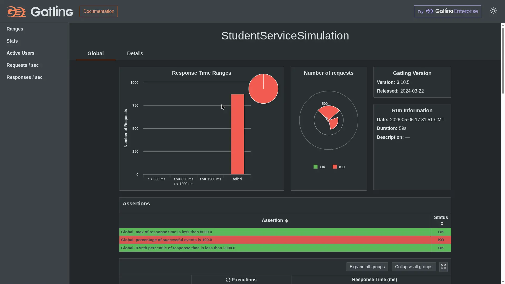
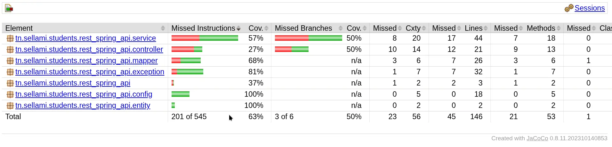

# Activity Part 4 — README Demo (READACT4)

Short recap of [activity_part4.md](md-activities/activity_part4.md): testing, Xray, traceability, and the auth microservice are now in place.

## What was done

- Unit tests, integration tests, Cypress E2E, and Gatling stress tests were added for the student service.
- JaCoCo is configured in [rest-spring-api/pom.xml](rest-spring-api/pom.xml) with an 80% line coverage gate.
- Xray CI publishing is defined in [.github/workflows/test-and-report.yml](.github/workflows/test-and-report.yml).
- The auth microservice is implemented in [auth-service/README.md](auth-service/README.md) and wired into [docker-compose.yml](docker-compose.yml).

## Demo evidence

### Cypress
- Cypress headless test output: [frontend/test-results.json](frontend/test-results.json)

### Gatling
- Result folder: [rest-spring-api/results/studentservicesimulation-20260506173150836](rest-spring-api/results/studentservicesimulation-20260506173150836)

### JaCoCo
- Result: coverage is enforced through Maven during `verify`.
- Gate: 0.80 minimum line coverage.
- Result folder: [./rest-spring-api/jacoco/](./rest-spring-api/jacoco/)
